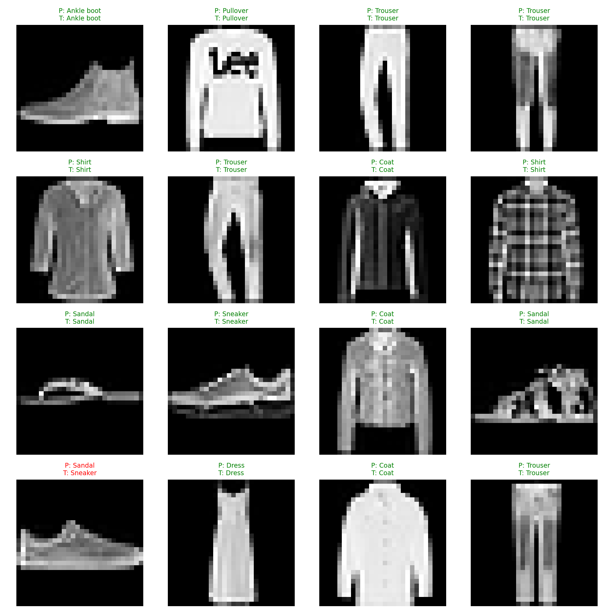
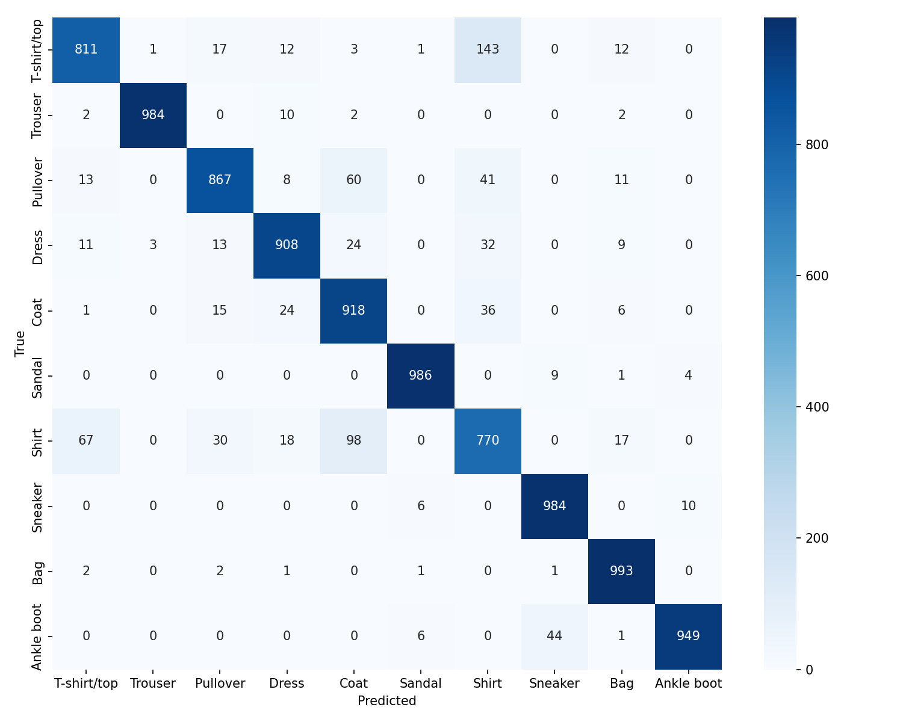

# FashionMNIST Deep Learning Pipeline (PyTorch)

This project implements a complete, production-style deep learning workflow using **PyTorch** on the FashionMNIST dataset.  
It includes:

- A clean and modular project structure  
- Training a TinyVGG-style CNN  
- Hyperparameter grid search  
- Automatic results logging  
- Plot generation  
- Experiment analysis  
- Automatic visualization of predictions and confusion matrix  
- A single unified `main.py` pipeline with flags  

The best model got an accuracy of over 91% on the testing data.

This repository is designed to demonstrate skills in **Deep Learning, MLOps-style structuring, Experiment Tracking, and Model Evaluation**.

---

## 🚀 Features

### ✔ **TinyVGG CNN model**
Simple but effective convolutional network suitable for image classification tasks.

### ✔ **Hyperparameter Grid Search**
Automatically tests combinations of:
- hidden units  
- learning rate  
- number of epochs  
- batch size  

and stores:
- trained models  
- training history  
- summary JSON with results  

### ✔ **Visualization**
The pipeline automatically:
- Loads the **best model found**  
- Generates **prediction grids** (correct/incorrect with colors)
- Generates a **confusion matrix**

### ✔ **Unified Execution Pipeline (`main.py`)**
Run any part of the project (training, grid search, plots, analysis, etc.) using CLI flags.

### ✔ **Automatic Logs**
All pipeline runs are logged inside `/logs`.

---

## 🖼 Example Outputs

### 🔍 Prediction Grid  
Green → Correct prediction  
Red → Incorrect prediction  

---

### 🔲 Confusion Matrix  

Shows which classes the model confuses the most.

---

## 📁 Project Structure

project/
│── src/
│ ├── main.py
│ ├── train.py
│ ├── grid_search.py
│ ├── engine.py
│ ├── dataset.py
│ ├── tinyvgg.py
│ ├── plot_results.py
│ ├── analyze_results.py
│ ├── visualize_predictions.py
│
│── models/ # Saved models (.pth) Created automatically
│── plots/ # All generated plots Created automatically
│── experiments/ # Grid search results + summary.json Created automatically
│── analysis/ # Automatic model analysis Created automatically
│── logs/ # Execution logs Created automatically
│
│── README.md
│── requirements.txt

## 🧼 Clean the project (delete models, plots, experiments, analysis)
python src/main.py --clean

## 🏋️ Train the base TinyVGG model
python src/main.py --train

## 🔍 Run the hyperparameter grid search
python src/main.py --grid

## 📊 Generate metrics plots (loss/accuracy over epochs)
python src/main.py --plots

## 📈 Analyze grid search results (best model, comparison, tables)
python src/main.py --analyze

## 👁️ Visualize predictions using the best model
This generates a confusion matrix and a grid with some images and their predictions in the folder plots.

python src/main.py --viz

## 🚀 Full Pipeline (Clean → Train → Grid → Plots → Analyze →  Visualize)
python src/main.py --clean --all

